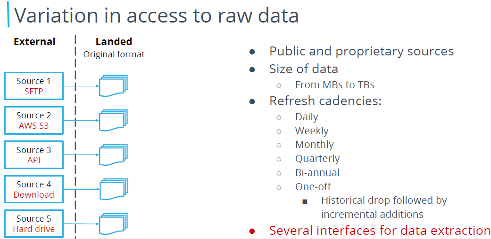
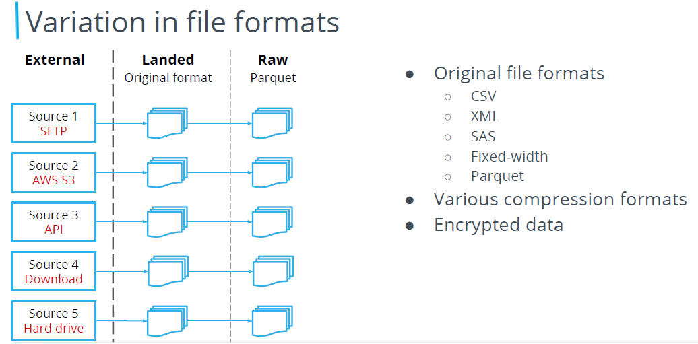
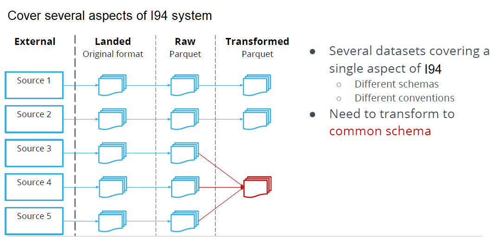
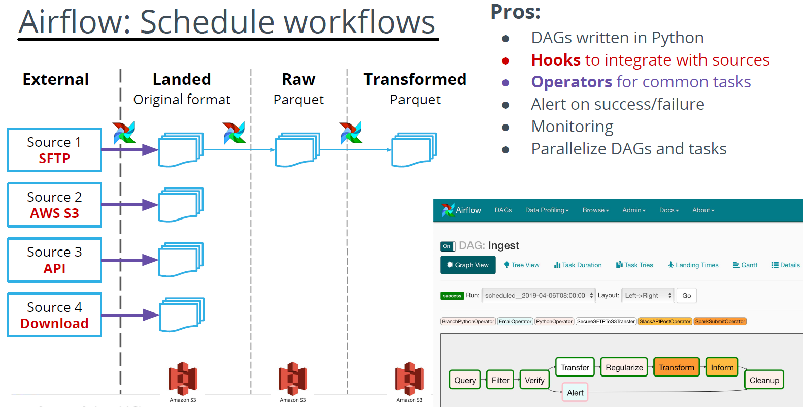

# Data Engineering Nanodegree
## Data Engineering Capstone Project

## Table of Contents
* **Scope of Works  :**
    The purpose of this project is to demonstrate various skills associated with data engineering projects. I will be developing highly Scalable Data Ingestion Architecture Using Airflow and Spark, constructing cloud data warehouses through Redshift databases and S3 data storage as well as defining efficient star schema data model.
    As an example I will perform a deep dive into I94 US immigration, Airport, Port of Entry City and City Weather , primarily focusing on the type of visas being issued and the profiles associated. The scope of this project is limited to the data sources listed below with data being aggregated across numerous dimensions such as visa type, gender, port of entry, nationality and month etc.
    * By which Air Lines Immigrants are coming to US?
    * Which city they are landing?
    * What is the weather of that city?
    * Further details and analysis, please refer the data exploration part.

## Data Sources & Description :
* **I94 Immigration Data:** This data comes from the US National Tourism and Trade Office found [here](https://travel.trade.gov/research/reports/i94/historical/2016.html). Each report contains international visitor arrival statistics by world regions and select countries (including top 20), type of visa, mode of transportation, age groups, states visited (first intended address only), and the top ports of entry (for select countries).
* **U.S. City Demographic Data:** This dataset contains information about the demographics of all US cities and census-designated places with a population greater or equal to 65,000. Dataset comes from OpenSoft found [here](https://public.opendatasoft.com/explore/dataset/us-cities-demographics/export/).
* **Airport Code Table:** This is a simple table of airport codes and corresponding cities. The airport codes may refer to either IATA airport code, a three-letter code which is used in passenger reservation, ticketing and baggage-handling systems, or the ICAO airport code which is a four letter code used by ATC systems and for airports that do not have an IATA airport code. It comes from [here](https://datahub.io/core/airport-codes#data).
* **World Temperature Data:** This dataset came from Kaggle found [here](https://www.kaggle.com/berkeleyearth/climate-change-earth-surface-temperature-data).

## Design Goals : 
At the project inception stage, I have defined a set of design goals to help guide the architecture and development work for data lineage to deliver a complete, accurate, reliable and scalable lineage system mapping immigration diverse data landscape. Let’s review a few of these principles:
1. Ensure data integrity — Accurately capture the relationship in data from disparate data sources to establish trust with users because without absolute trust lineage data may do more harm than good.
1. Enable seamless integration — Design the system to integrate with a growing list of data tools and platforms including the ones that do not have the built-in meta-data instrumentation to derive data lineage from.
1. Design a flexible data model — Represent a wide range of data artifacts and relationships among them using a generic data model to enable a wide variety of business use cases.

## Data Exploration :
   Further details and analysis can be found 
* ***Capstone_Project_Final_Notebook***: This notebook is having all final notes [here](Capstone_Project_Final_Notebook.ipynb).  
* ***Immgration_data_exploration***: This note book is having immigration related data exploration [here](Immgration_data_exploration.ipynb).
* ***PortOfEntry_data_exploration***: This note book is having port of entry related data exploration [here](PortOfEntry_data_exploration.ipynb).
* ***World_Temperature_data_exploration***: This note book is having world temperature related data exploration [here](World_Temperature_data_exploration.ipynb).
* ***Airport_data_exploration***:This note book is having Airport related data exploration [here](Airport_data_exploration.ipynb).
    
* **Notes:** Data comes from different sources (like log files, data warehouses and third-party APIs etc). It is important to explore the structure, volume, granularity and frequency of data, data quality, data relationship etc.    
    
## Data Modelling :
After doing the data exploration from various data sources i.e. I94 Immigration Data (immigration codes file  `I94_SAS_Labels_Descriptions.SAS`),U.S. City Demographic Data,Airport Code and World tempeture Data. I was able to define a star schema by extracting the immigration fact table and various dimension tables as shown below:

## ETL Pipeline Framework :
  * **ETL Design Principles** : Below are the design principles has been taken care during the pipeline deevlopment
    1. Variation in data size and cadency
    

    1. Variation in access to raw data
    

    1. Variation in file formats
    

    1. Cover several aspects of I94 system
    

    1. Security and Privacy
    

    1. Airflow Schedule workflows
    

    1. Spark Distributed Processing
    

    1. Data Quality
    

Defining the data model and creating the star schema involves various steps, made significantly easier through the use of Airflow. The process of extracting files from S3 buckets, transforming the data using Spark and saving into PARQUET files. Then writing PARQUET files to Redshift is accomplished through various tasks highlighted below in the ETL Dag graph. These steps include:
- Extracting data from SAS Documents and writing as CSV files to S3 immigration bucket
- Extracting remaining CSV and PARQUET files from S3 immigration bucket
- Processing PARQUET files store into Star Shchema Dimenions format into S3 transformed bucket
- Writing PARQUET files from S3 to Redshift
- Performing data quality checks on the newly created tables
- Final ETL pipeline looks like below
    
 
## Data Storage
Data was stored in S3 buckets in a collection of PARQUET files. The immigration dataset extends to several million rows and thus this dataset was converted to PARQUET files to allow for easy data manipulation and processing through Dask and the ability to write to Redshift star schema with proper distribution key.

## Conclusion
Overall this project was a small undertaking to demonstrate the steps involved in developing a data warehouse that is easily scalable. Skills include:
* Understand the problem statement and data.
* Dig into data exploration for data structure, volume,granulity, data quality, relationship and frequency of data
* Creating a Redshift Cluster, IAM Roles, Security groups.
* Developing an ETL Pipeline that copies data from S3 buckets into staging tables to be processed into a star schema
* Developing a star schema with optimization to specific queries required by the data analytics team.
* Using Airflow to automate ETL pipelines using Airflow, Python, Spark and Amazon Redshift.
* Writing custom operators to perform tasks such as staging data, filling the data warehouse, and validation through data quality checks.
* Transforming data from various sources into a star schema optimized for the analytics team's use cases.
